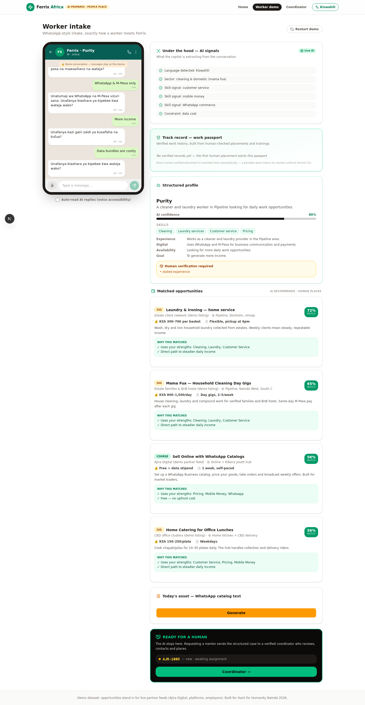
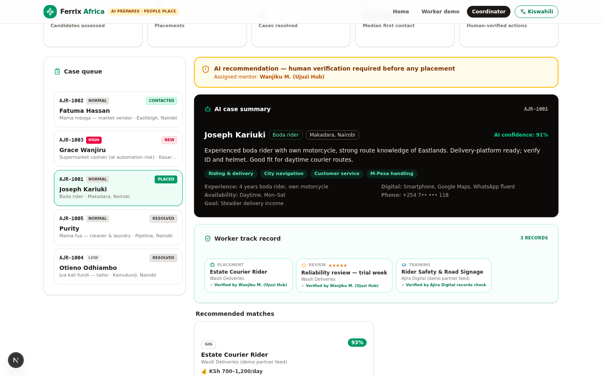
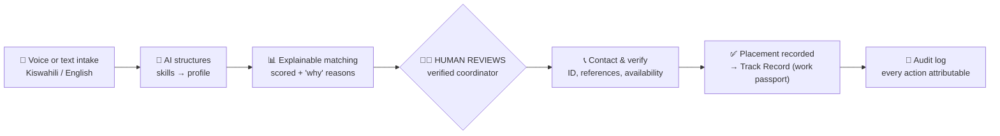

# Ferrix 🌍

**AI prepares the worker. People make the placement.**

Ferrix is a voice-first AI livelihood copilot for Africa's informal workforce — mama fuas, fundis, traders, riders and the millions of workers the formal economy never built a CV for. It listens in Kiswahili or English, turns real-life skills into a structured profile, matches verified earning paths — and then **hands every decision to a human coordinator** who verifies, contacts and places.

> Built for **Hack for Humanity — Nairobi 2026** (AI Collective), on the official themes of *job displacement*, *technical literacy* and *accessibility*.

[](LICENSE)
[](https://nextjs.org)
[](https://prisma.io)
[](https://github.com/Roy-Wanyoike/ferrix)

---

## Why this exists

Roughly **8 in 10 workers in Kenya earn outside the formal economy** — as market vendors, domestic workers, mechanics, cleaners, riders and jua kali fundis. They are:

- **First to be displaced by automation** — self-checkout tills, app-managed logistics, AI customer service — yet last to be served by AI tools.
- **Invisible to employers** — years of real skill with zero paper trail. No CV, no references, no work history.
- **Locked out by design** — most "AI job platforms" assume typing, English, email and a laptop. Not a phone, a voice, and a bundle.

Ferrix flips the script: **the AI does the paperwork, the human does the trust.**

| | |
|---|---|
|  |  |
| *Worker side: voice-first WhatsApp-style intake, live AI in Kiswahili, explainable matches* | *Coordinator side: the human layer — verified placements build a portable work passport* |

---

## How it works — the trust pipeline

The AI **never** places anyone. Every step of the journey below is timestamped and attributable in an audit trail.



**The 90-second demo path:** pick a persona (mama fua, mama mboga, boda rider, cashier facing self-checkout, jua kali fundi) → chat in Swahili or English → the AI extracts skills live (watch the "under the hood" signal panel) → tap *Build my profile* → scored matches with reasons → generate a WhatsApp catalog on the spot → hand off to a human coordinator → accept → contact → place → resolve. Every placement the coordinator records **automatically writes an entry into the worker's track record**.

---

## What makes it different

### 1. Human-in-the-loop by architecture, not disclaimer
Most demos bolt on "AI is advisory" as a label. Ferrix enforces it in the data model: an AI match is a *suggestion row*; a placement only exists after a coordinator action, and every placement writes an auditable `CaseEvent` **and** a verified `TrackRecordEntry`. The trust claim is the schema.

### 2. A track record for workers without CVs
Informal workers have no way to prove experience. Ferrix builds a **portable, verifiable work passport**: every human-checked placement, completed training and employer review accumulates into a shareable history (copy-as-text today, on-chain or verifiable-credential tomorrow). New workers start empty — the product *earns* their history with them.

### 3. Voice-first, bilingual, offline-safe
- Speak instead of type — Web Speech API input, one-tap listen buttons, auto-read mode.
- Full **English + Kiswahili** UI, and the AI mirrors the worker's language (including Sheng-friendly input).
- Hybrid AI architecture: live LLM when reachable, **scripted Swahili fallback when not** — the demo cannot die mid-pitch on venue Wi-Fi. Fallback responses are honestly labeled in the UI.

### 4. Real market jobs, not tech-bubble jobs
The opportunity feed covers what the market actually offers, with Nairobi-realistic pay ranges: **mama fua day gigs, house help, laundry services, residential plumbers (fundi maji), certified electricians (fundi stima), welders, carpenters, masons, painters, fridge & AC technicians, car mechanics, phone repair, tuk-tuk drivers, barbers** — alongside Ajira Digital / NITA certification paths and online microwork for those who want the digital leap.

---

## What's inside

**Worker view** — WhatsApp-styled intake, persona quick-starts, live AI signals panel, structured profile with confidence score, matched opportunities with "why this matches you", one-tap WhatsApp catalog generator, human-handoff with case reference, and the personal **track record (work passport)**.

**Coordinator view** — live stats (candidates assessed, placements, median first contact, human-verified actions), prioritized case queue, AI case summary, the worker's track record inline, contextual workflow actions (accept → contact → place → resolve) and a color-coded audit trail by actor (AI / System / Coordinator).

| Layer | Tech |
|---|---|
| Frontend | Next.js 16 (App Router), React 19, Tailwind CSS 4, shadcn/ui, Framer Motion |
| Backend | Next.js API routes (Node runtime), Zod-shaped JSON contracts |
| AI | LLM intake + structured profile extraction + asset generation, with deterministic scripted fallbacks |
| Matching | Deterministic, explainable tag-overlap scorer — inspectable by judges, tunable by operators |
| Database | Prisma ORM + SQLite locally (swap to Postgres/Turso for production — see below) |
| i18n | Full EN/SW dictionary, per-message language mirroring |

```text
src/
├── app/
│   ├── page.tsx                    # single-route app: landing ⇄ worker ⇄ coordinator
│   └── api/
│       ├── chat/                   # conversational intake (live LLM + fallback)
│       ├── analyze/                # profile extraction + matching + case creation
│       ├── asset/                  # WhatsApp catalog / mini-CV generation
│       ├── cases/                  # coordinator queue + workflow actions (audit-logged)
│       ├── track-record/           # work passport: GET entries + summary, POST verified records
│       └── stats/                  # honest, derived platform stats
├── components/ajira/
│   ├── landing.tsx                 # hero, official themes, trust pipeline
│   ├── worker-view.tsx             # phone-frame chat experience
│   ├── worker-panels.tsx           # signals, profile, matches, track record, assets
│   └── coordinator-view.tsx        # the human layer dashboard
└── lib/
    ├── ai.ts                       # prompts + LLM helpers + JSON extraction
    ├── data.ts                     # personas, 27-opportunity demo feed, fallback script
    ├── matcher.ts                  # explainable scoring
    └── i18n.ts                     # EN/SW strings
```

---

## For recruiters: what this codebase demonstrates

- **Product judgment** — a trust architecture encoded in the data model, not in a slogan; honest AI fallbacks labeled in the UI; demo data clearly marked.
- **Full-stack delivery** — schema design (Prisma), REST API design, LLM orchestration with timeouts and graceful degradation, deterministic fallback logic, component architecture.
- **UX for real users** — voice-first flows, bilingual i18n, WhatsApp-native patterns, low-bandwidth empathy, mobile-verified layouts.
- **Engineering hygiene** — ESLint-clean, strict TypeScript-clean (`tsc --noEmit`), seeded fixtures, browser-verified golden path, scripted E2E (`scripts/e2e.sh`).

## Run it locally

```bash
git clone https://github.com/Roy-Wanyoike/ferrix.git
cd ferrix
bun install                # or npm install
cp .env.example .env
npm run db:push            # create SQLite schema
npm run db:seed            # seed 27 opportunities + 4 demo cases + track records
npm run dev                # http://localhost:3000
```

Demo logins: none — the coordinator view is one click away by design (it's a prototype, and the demo script is the pitch).

## Deploying to Vercel

You can deploy with one click — then make **two small changes** first:

[](https://vercel.com/new/clone?repository-url=https%3A%2F%2Fgithub.com%2FRoy-Wanyoike%2Fferrix)

### The honest challenges (and the fixes)

| Challenge | Why | Fix |
|---|---|---|
| **SQLite doesn't persist on Vercel** | Serverless functions have an ephemeral, read-only filesystem — `file:./db/custom.db` resets per invocation. | Switch Prisma to a hosted DB: **Neon / Vercel Postgres** (`provider = "postgresql"` in `schema.prisma` + `DATABASE_URL`) or **Turso** (SQLite-compatible, cheapest migration). Then `prisma db push` + `npm run db:seed` once against the remote DB. |
| **The bundled AI SDK is sandbox-bound** | `z-ai-web-dev-sdk` authenticates via this environment. On Vercel the live-LLM path needs a standard provider. | Swap `llmChat()` in `src/lib/ai.ts` to any hosted API (Gemini, Groq, OpenAI) behind an env key — the interface is a single function. Until then the **scripted fallback keeps every demo path working**, honestly labeled. |
| **Prisma engine binaries** | Vercel runs Node functions on Amazon Linux. | Already handled: `binaryTargets = ["native", "rhel-openssl-3.0.x"]` in the schema and `postinstall: prisma generate` in package.json. |
| **Voice input needs HTTPS** | Web Speech API requires a secure context. | Non-issue on Vercel (automatic HTTPS). Note: iOS Safari support is patchy — Kenya's Android/Chrome majority is unaffected. |
| **Seeding is a one-off, not a build step** | `db:seed` is a script, not a migration. | Run it once locally pointed at the remote `DATABASE_URL`. |

### Roadmap (post-hackathon)

1. **WhatsApp Business API / Twilio SMS** — real channels instead of the simulated chat.
2. **Postgres + row-level security**, coordinator auth (phone OTP), organization accounts.
3. **Verifiable track records** — signed work passports a worker owns and carries across platforms.
4. **Employer portal** — demand side: post gigs, confirm attendance, write reviews into the passport.
5. **Offline USSD path** — feature-phone intake for the lowest-literacy, lowest-data users.

## Hackathon alignment

- **Job displacement** — starts with the exposed (cashiers facing self-checkout, riders facing automation) and moves them to verified earning paths before the shock lands.
- **Technical literacy** — users learn AI by using it: a conversation that shows its own reasoning signals, teaches WhatsApp commerce, and builds digital confidence step by step.
- **Accessibility** — voice-first, Kiswahili + English, works on a low-end Android, and keeps working when the network doesn't.

---

*"AI shouldn't replace the people who keep this city running. It should help them earn."*

Built by **Roy Wanyoike** for Hack for Humanity Nairobi 2026. Opportunities in the demo are a curated dataset standing in for live partner feeds (Ajira Digital, platforms, employers) — every listing is marked as demo data. MIT licensed.
